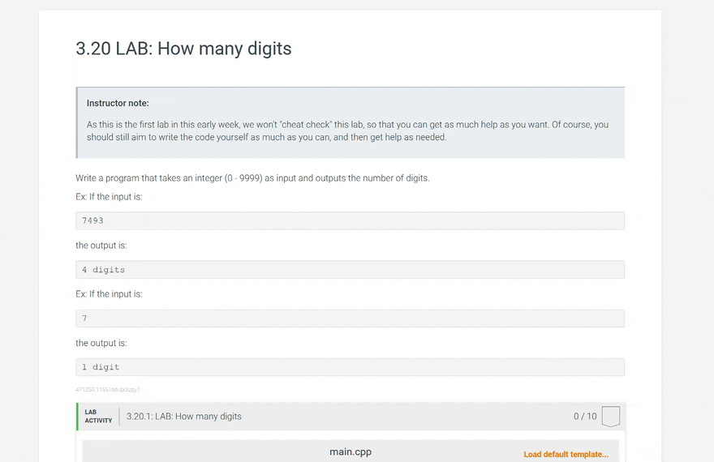

<div align="center">
  <h1 align="center">Programming Behavior Analysis (PBA)</h1>
  <h3 align="center">Find potential cheating without similarity.</h3>
</div>

This project finds students that are potentially cheating in CS courses using metrics beyond code similarity. Instructors can prioritize their time when investigating cheating cases by looking at top students in these metrics.

> **IMPORTANT**: Students flagged by this program are not necessarily cheating. Instructors should always thoroughly investigate flagged students before making a cheating determination.

## Features

**Style Anomalies**: Finds unusual code styles that are not taught in a course. Styles are easily configurable with RegEx and can be given different weights.

**Hardcoding Detection**: Finds students that are abusing automated grading systems by hardcoding to testcases in code.

**Incremental Development**: Measures how "incrementally" students are developing their solution. Finds students that may be copying a solution instead of slowly developing their own.

**Quick Analysis**: Gives averages for each assignment: time spent, number of times code was submitted or tested, and assignment score.

**Roster**: Gives statistics for each student in a class: points earned per minute, total time spent, score, number of submissions and tests, and the same metrics per assignment.

## Getting Started

This project is currently meant to be used with introductory CS courses that teach C++ using zyBooks. PBA needs a zyBooks logfile (`.csv`) for an assignment as input, and most tools expect C++ code.

### Prerequisites

You need the following to use PBA:
- Git (download and install [here](https://git-scm.com/book/en/v2/Getting-Started-Installing-Git))
- Python 3.6+ (download and install [here](https://www.python.org/downloads/))
- A zyBooks C++ course
- A `.csv` zyBooks logfile of student submissions for an assignment(s)

### 0. Downloading zyBooks logfiles

For PBA to generate metrics for an assignment, you need a logfile of student submissions in `.csv` format for that assignment. To get this, follow the GIF below:



To analyze multiple assignments, download a logfile like so:


The logfile will be called `zylab_log_CourseNameHere_DateHere.csv` with contents like this:

```
| zybook_code   |   lab_id |   content_section | caption         |   user_id | first_name   | last_name   | email            | class_section   | role    | date_submitted(UTC)   | zip_location   | is_submission   | score   | max_score   | result   | ip_address   |
|:--------------|---------:|------------------:|:----------------|----------:|:-------------|:------------|:-----------------|:----------------|:--------|:----------------------|:---------------|:----------------|:--------|:------------|:---------|:-------------|
| CS1Class      |      123 |               3.2 | How many digits |        -1 | Solution     | Solution    |                  |                 |         |                       | url1           |                 |         |             | …        |              |
| CS1Class      |      123 |               3.2 | How many digits |       345 | Benjamin     | Denzler     | bdenz001@ucr.edu |                 | Student | 4/24/2023 3:47        | url2           | 1.0             | 0.0     | 10.0        | …        |              |
| CS1Class      |      123 |               3.2 | How many digits |       345 | Benjamin     | Denzler     | bdenz001@ucr.edu |                 | Student | 4/24/2023 3:47        | url3           | 1.0             | 8.0     | 10.0        | …        |              |
| CS1Class      |      123 |               3.2 | How many digits |       345 | Benjamin     | Denzler     | bdenz001@ucr.edu |                 | Student | 4/24/2023 3:47        | url4           | 1.0             | 10.0    | 10.0        | …        |              |
```

### 1. Clone the repository

```
git clone https://github.com/UCR-CS-Ed-team/PBA-Offline
cd PBA-Offline
```

### 2. Install dependencies
```
pip install -r requirements.txt
```

### 3. Run PBA
```
python main.py
```

A window will appear for you to select a zyBooks logfile to analyze. Choose the `.csv` file you downloaded, then follow the instructions to choose metrics to evaluate.

The tool's output will be in the folder `output`. The tool tells you the output filename after it completes:

```
Done! Wrote output to output/{file}.csv
```

## PBA's Cheating Metrics

PBA can generate these metrics for assignments:

### Style Anomalies

Style anomalies are unusual code styles that are not taught in a class.  For example:

```cpp
// Expected style taught in class
int main() {
    int x;
    cin >> x;
    while (x > 0) {
        cout << x * x;
        cin >> x;
    }
}
```

```cpp
// Code with style anomalies
int main() {
    int x;
    cin >> x;
    while (true)    // Anomaly
    {               // Anomaly; brace style
cout << x * x;      // Anomaly; spacing
        cin >> x;
        if (x <= 0) {
            break;  // Anomaly; untaught construct
        }
    }
}
```

In our experience, an abundance of style anomalies suggests a student copied from ChatGPT, Chegg, etc.

PBA comes with style anomalies specific to CS1 courses at UC Riverside. These are in `tools/anomaly.py` in the list `style_anomalies`. To add your own style anomalies, add a `StyleAnomaly` object to the list, providing the following:
- Name of the style anomaly
- A regular expression to find the anomaly in code; will search one line at a time
- (`True/False`) Should the anomaly be enabled?
- A weight to give the anomaly
- A cap on the number of instances of this anomaly to find per-student, defaults to `-1` (no cap)

Each style anomaly has its own weight. PBA will scan each line of a student's submission to find style anomalies. For each style anomaly found for a student, the anomaly's weight gets added to the student's Style Anomaly Score, and their Style Anomaly Count increases by 1. 

Optionally, a style anomaly can be configured to only be counted up to `X` times for each student. This can prevent one style anomaly from being counted an excessive number of times. There is no cap initially, but it can be enabled by changing `-1` to `X` in the last parameter for an anomaly:

```py
style_anomalies = [                                 # --V-- change -1 to X
    StyleAnomaly('Pointers', POINTERS_REGEX, True, 0.9, X),
    StyleAnomaly('Infinite Loop', INFINITE_LOOP_REGEX, True, 0.9, -1),
    ...
]
```

The tool's output looks like:

```
|   User ID | Last Name   | First Name   | Email            | Role    |   Lab 2.24 anomalies found |   Lab 2.24 anomaly score | 2.24 Student code   |   Lab 2.25 anomalies found |   Lab 2.25 anomaly score | 2.25 Student code   |   Lab 2.26 anomalies found |   Lab 2.26 anomaly score | 2.26 Student code   |
|----------:|:------------|:-------------|:-----------------|:--------|---------------------------:|-------------------------:|:--------------------|---------------------------:|-------------------------:|:--------------------|---------------------------:|-------------------------:|:--------------------|
|    604387 | Benjamin    | Denzler      | bdenz001@ucr.edu | Student |                          1 |                      0.3 | {code here}         |                          3 |                      0.5 | {code here}         |                          6 |                      0.6 | {code here}         |
```
